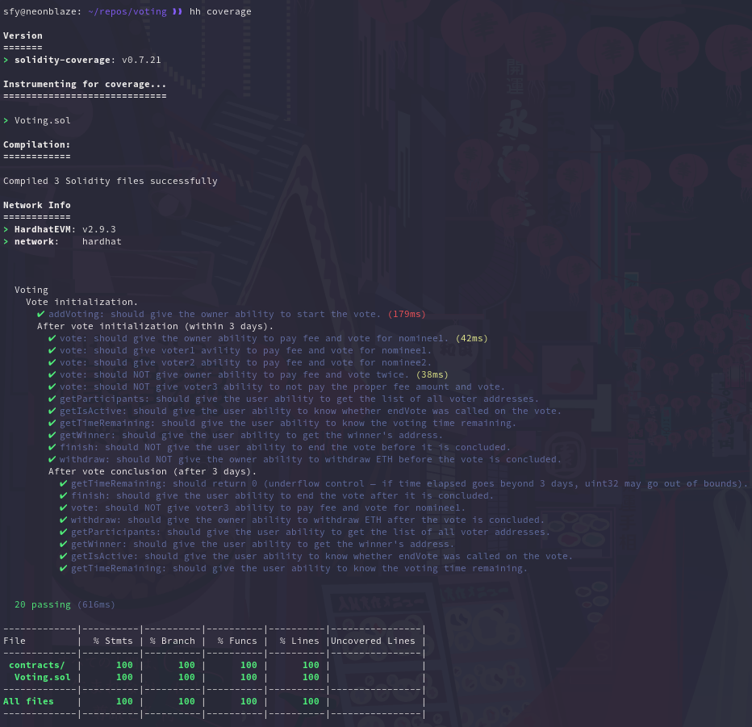

# Voting with prize 💫

## Features (smart contract)

[x] Only *owner* can start the vote.
[x] Vote lasts for 3 days.
[x] Any user can vote for any other user.
[x] Voting fee is 0.01 ETH.
[x] A single user can vote only once.
[x] After 3 days from the vote's start, any user can end the vote.
[x] Winner receives 90% of total ETH collected. Remaining 10% of total ETH are left untouched.
[x] Only *owner* may withdraw the remaining 10% of total ETH.
[x] Any user can fetch information about a particular vote.

## Features (JS scripts)

- **Unit tests**: 100% coverage according to *solidity-coverage*.

  

- **Tasks**: every ABI function has a related task script in *tasks/*.

## Additional info

1. Address of the deployed contract (Rinkeby testnet) is set in *tasks/address.js* for convenience purposes.

```
sfy@neonblaze: ~/repos/voting ❱❱ cat tasks/address.js
const votingAddress = '0xCaf1C1AA53D3513ec2d96A85f830EA5B89e53aFe';
module.exports = votingAddress;
```

2. **Don't forget to append _--network rinkeby_ when using tasks with the contract deployed to testnet.**

```
sfy@neonblaze: ~/repos/voting ❱❱ npx hardhat vote --voteid 2 --nominee '0x53b5Dd95992F7C197bCe8a9Dc92546CD83B39a98' --fee 10000000000000000 --network rinkeby
voteId is 2, voter is 0x9271EfD9709270334721f58f722DDc5C8Ee0E3DF, nominee is 0x53b5Dd95992F7C197bCe8a9Dc92546CD83B39a98
```
