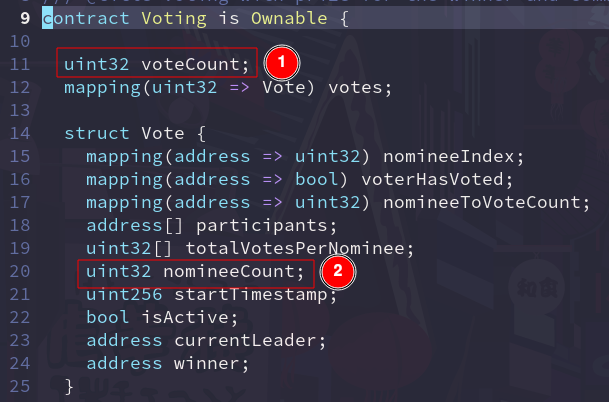
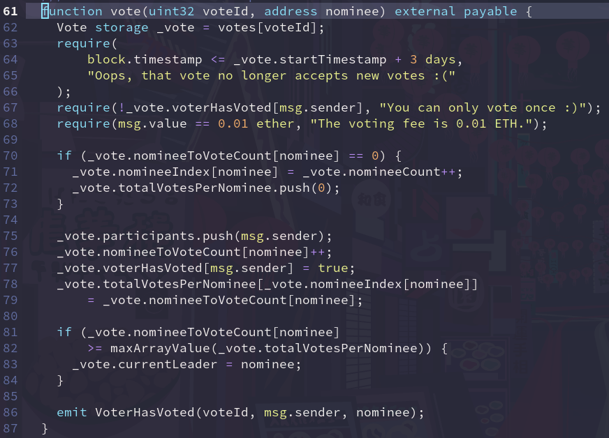
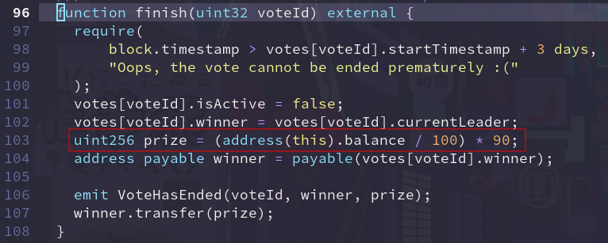
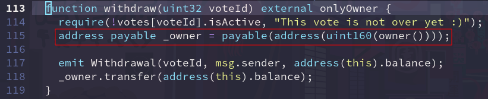
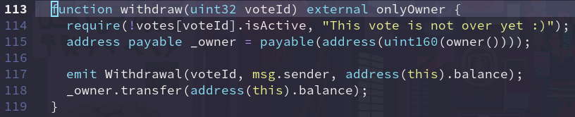

# Voting with prize 💫

## Features (smart contract)

- [x] Only *owner* can start the vote.
- [x] Vote lasts for 3 days.
- [x] Any user can vote for any other user.
- [x] Voting fee is 0.01 ETH.
- [x] A single user can vote only once.
- [x] After 3 days from the vote's start, any user can end the vote.
- [x] Winner receives 90% of total ETH collected. Remaining 10% of total ETH are left untouched.
- [x] Only *owner* may withdraw the remaining 10% of total ETH.
- [x] Any user can fetch information about a particular vote.

## Features (JS scripts)

- **Unit tests**: 100% coverage according to *solidity-coverage*.

  

- **Tasks**: every ABI function has a related task script in *tasks/*.

## Additional info

1. Address of the deployed contract (Rinkeby testnet) is set in *tasks/address.js* for convenience purposes.

```
sfy@neonblaze: ~/repos/voting ❱❱ cat tasks/address.js
const votingAddress = '0xCaf1C1AA53D3513ec2d96A85f830EA5B89e53aFe';
module.exports = votingAddress;
```

2. **Don't forget to append _--network rinkeby_ when using tasks with the contract deployed to testnet.**

```
sfy@neonblaze: ~/repos/voting ❱❱ npx hardhat vote --voteid 2 --nominee '0x53b5Dd95992F7C197bCe8a9Dc92546CD83B39a98' --fee 10000000000000000 --network rinkeby
voteId is 2, voter is 0x9271EfD9709270334721f58f722DDc5C8Ee0E3DF, nominee is 0x53b5Dd95992F7C197bCe8a9Dc92546CD83B39a98
```

## To do

> "Practice doesn't make perfect. Practice reduces the imperfection."
> _Toba Beta, "Master Of Stupidity"_

My contract is not perfect. I constantly work on refining my craft and thus I ask senior colleagues for suggestions. And I don't blatantly copy/paste suggestions but try to get a deep understanding of my own mistakes so that I don't repeat them in the future.

**Core functionality works exactly like explained above, all to do's are mere improvements.**

**Thanks to my friend Arthur who pointed out the issues.**

1. ~~_uint32_ usage where _uint256_ could be used~~ **FIXED @6830500a56bff33309375301352e7ebfce49f324**

    

    Explanation: memory slots in Solidity are 256 bytes based.
    Using lesser uint sizes makes sense mainly if adjacent declarations fit in 256 bytes or if lesser-sized variables are required by proposed logic.

2. _vote(uint32 voteId, address nominee)_: suboptimal logic

    

3. ~~_finish(uint32 voteId)_: incorrect arithmetic operations order~~ **FIXED @5186e80ff7719b2d984280aac2ef30e848f3abc2**

    

    Explanation: Solidity uses integer-based arithmetic. As a result when I divide before multiplying, I may lose precision.
    E.g. if I want 90% of 10 and first divide by 100, then I get 0.
    On the other hand, if I would do (value * 90) / 100, the percentage is correct.

4. ~~_withdraw(uint32 voteId)_: redundant address payable cast~~ **FIXED @ff02b63c212425367641cdb8944def898d03b536**

    

    Explanation: initial cast was taken from the CryptoZombies tutorial.
    I blindly repeated it, despite the fact that in Solidiy 0.8.1^ such a cast is redundant. 

5. _withdraw(uint32 voteId)_: vulnerability

    
